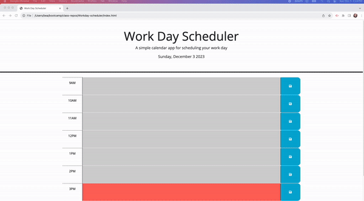

# Workday-scheduler

## Description
This repository was created to manage the person's time effectively, by adding important events to a daily planner

## Installation

N/A

deployed site: https://beabravo.github.io/Workday-scheduler/ 

## Usage

1. Load page and a daily planner with working hour blocks should load. These blocks are color coded, depending if they're in the future, past or current hour block.
2. Type the event/meeting information in the desired block and hit the blue '💾' save button.
3. These events/meetings will persist as the page is re-loaded. 

## Credits

worked with Nick Catalano to get it to update local storage

## License

Please refer to the license in repo
